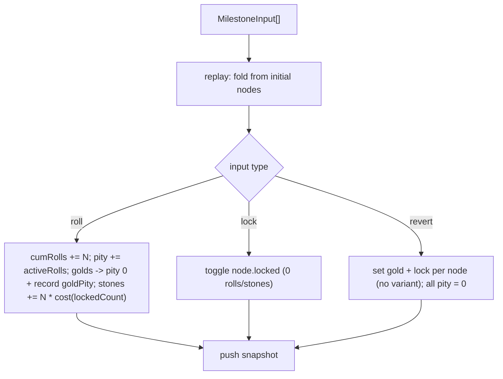

# Where Winds Meet — Reforge Pity Tracker

## Product & Technical Specification

---

## 1. Overview

### 1.1 Vision

A fast, client-side single-page app that lets *Where Winds Meet* players **track the pity of a weapon-skin reforge session**. Reforge is a gacha system with five separate nodes, each with its own pity counter, lock state, and per-roll cost. Rather than logging every single roll, the player records a **milestone** whenever something notable happens — a node turns gold, a node is locked/unlocked, or the look is reverted — entering how many rolls happened since the last milestone. The app derives a per-node **status table** from those milestones: each node's pity, tier, lock state, and the running roll/stone totals.

This is the second app in the `wwm` monorepo, alongside the [Boss Guide](SPEC.md). It is intentionally a **pure tracker** — it does not simulate rolls or advise strategy; the player performs rolls in-game and records the milestones.

### 1.2 Goals

| # | Goal | Success Metric |
|---|------|----------------|
| 1 | Accurately track per-node pity across a session | Pity counters match in-game state with minimal input |
| 2 | Keep input low-effort and miss-free | One milestone per gold event; many rolls batched at once |
| 3 | Persist sessions with zero setup | State survives reloads via localStorage; no account needed |
| 4 | Match the Boss Guide's wuxia aesthetic | Shared dark ink-wash palette |

### 1.3 Target Audience

- Players actively reforging a weapon skin who want to know when to keep rolling vs. lock a node.
- Players budgeting stones across a long reforge session.

---

## 2. Reforge Mechanics (domain reference)

Full source: [docs/reforge.md](reforge.md). The rules the app models:

### 2.1 Nodes

A weapon skin has **5 nodes**:

| Node | Name | Notes |
|------|------|-------|
| 1 | Color Node | ~10 gold variances: 2 align with Set A / Set B, plus ~8 unique colors |
| 2 | Part 1 | 2 gold variances (Set A / Set B) + purple + blue |
| 3 | Part 2 | 2 gold variances (Set A / Set B) + purple + blue |
| 4 | Part 3 | 2 gold variances (Set A / Set B) + purple + blue |
| 5 | Misc | **Special** — in-game "Highlight"; see 2.5 |

### 2.2 Tiers and Sets

- Three tiers per node: **Gold** (best), **Purple** (average), **Blue** (low).
- Gold has two "sets" per skin: **Set A** and **Set B**. The ideal look is all five nodes gold in the *same* set.
- Node 1 additionally has ~8 unique gold colors outside the two sets (for players who want a custom color).

> The tracker intentionally does **not** record which set/variant a gold lands on — only that a node is gold. Variant is cosmetic and irrelevant to pity, so it is omitted to keep input minimal.

### 2.3 Pity

- Each node has an **independent** pity counter.
- A roll increases pity by 1 for every node that is **enabled and unlocked**.
- Pity **resets to 0** when that node hits gold.
- **Hard pity = 90** (guaranteed gold). Observed **soft pity ≈ 30-40**.

### 2.4 Unlocks (by total rolls)

Nodes unlock sequentially as total rolls accumulate. Pity is only tracked once a node is enabled. Unlocks are **permanent**.

| Node | Enabled at (total rolls) |
|------|--------------------------|
| 1 | 0 (enabled from the start) |
| 2 | 24 |
| 3 | 40 |
| 4 | 70 |
| 5 | 99 |

### 2.5 Node 5 (Misc) — special

- No blue/purple tier. Once enabled, it is **permanently gold**.
- Its gold value is **derived** in-game from the other nodes' set, not rolled. Since the tracker does not track sets, it simply shows Node 5 as **gold** once enabled.
- It has **no pity** and is **not lockable / not counted** in the per-roll cost.

### 2.6 Locking and roll cost

- Any enabled node can be **locked** so a roll will not re-randomize it; a locked node's pity is frozen and does not advance.
- Cost scales with the number of locked nodes. Because only nodes 1-4 are rollable, the maximum while still rolling is 3 locked:

| Locked nodes | Stones per roll |
|--------------|-----------------|
| 0 | 1 |
| 1 | 2 |
| 2 | 5 |
| 3 | 10 |

### 2.7 Color Node constraint (informational)

Node 1 can only roll a Set A/B gold once **another** node already holds that set's gold (or both land in the same lucky roll). The app surfaces this as a small note; it does not block input.

### 2.8 Revert

- In-game a player can save a look and later **revert** to it. Per the in-game behavior, reverting **resets every node's pity to 0** (so pity-stacking via save/revert is not feasible).
- The tracker models a revert as a milestone: the player records the reverted look (gold/lock per node) and all pity is zeroed. Stones already spent and total rolls are kept (unlocks are permanent). There are no named "plans" — the milestone log itself is the saved data.

---

## 3. Information Architecture

A single screen (no routing). Top to bottom:

```
Reforge Pity Tracker (/)
├── Header (title)
└── Three-column layout (stacks on mobile; rails are sticky on desktop)
    ├── Legend (left) — static key for the table's color / pulse / mark cues
    ├── Tracker (center)
    │   ├── SessionBar (active-session select · New · manage menu: rename / delete)
    │   ├── CurrentStateBar
    │   │   ├── totals (total rolls · stones spent · roll cost)
    │   │   ├── per-node chips (pity · gold-tinted when gold · lock toggle · "about to pop" pulse)
    │   │   └── actions (Add Rolls · Restore Plan · Reset)
    │   ├── Milestone form (inline; shown when adding or editing a roll/revert milestone)
    │   └── MilestoneTable (rows = milestones, columns = the 5 nodes + roll/stone totals)
    └── GoldStats (right) — gold counts per pity range (size-5 buckets)
```

Everything in the tracker column reflects the **active** session; switching sessions swaps the whole view (current state, forms, table, and the gold-luck stats). Lock/unlock is done by clicking a node chip's lock toggle, which appends a lock milestone to the active session. The current state is simply the last row of the table.

---

## 4. Data Model

Each session is an ordered list of milestone **inputs**; its table is *derived* by replaying them (nothing computed is persisted). The app holds many named sessions and remembers which one is active. Defined in [apps/reforge/src/types/reforge.ts](../apps/reforge/src/types/reforge.ts):

```typescript
type NodeId = 1 | 2 | 3 | 4 | 5;
type Tier = 'blue' | 'purple' | 'gold'; // in practice only 'gold' or null is tracked

// Derived per-node state (produced by replay; only authored via a revert input).
interface NodeSnapshot {
  id: NodeId;
  enabled: boolean;       // unlocked yet? derived from cumulative rolls (permanent)
  locked: boolean;        // frozen pity + raises roll cost
  pity: number;           // rolls toward next gold; 0 on gold; always 0 for Node 5
  tier: Tier | null;      // 'gold' (held by a lock) or null; Node 5 is gold once enabled
}

interface RevertNodeInput { id: NodeId; gold: boolean; locked: boolean }

// The user-authored unit; everything else is derived from an ordered array.
// A roll's goldHits is just the ids of the nodes that turned gold (no variant -
// this is a pure pity tracker).
type MilestoneInput =
  | { id: string; type: 'roll'; rolls: number; goldHits: NodeId[] }
  | { id: string; type: 'lock'; nodeId: NodeId; locked: boolean }
  | { id: string; type: 'revert'; nodes: RevertNodeInput[] };

// A derived row: input + running totals + the full snapshot after applying it.
interface Milestone {
  input: MilestoneInput;
  index: number;
  rolls: number; cumulativeRolls: number;
  stones: number; cumulativeStones: number;
  nodes: NodeSnapshot[];
  label: string;
  goldPity?: Partial<Record<NodeId, number>>; // pity-at-gold per node golded here
}

// A named session is just its ordered inputs; its table is derived on demand.
interface Session { id: string; name: string; inputs: MilestoneInput[] }

// v3 holds many named sessions plus the active one's id. (v2 was a single
// `inputs` array, migrated into one Session on load - see storage.ts#coerceState.)
interface PersistedState { version: 3; sessions: Session[]; activeSessionId: string }

// JSON envelope for a single exported/imported session (one file = one session).
// `exportVersion` is the file-format version, separate from PersistedState.version;
// the session id is omitted and minted fresh on import. See lib/sessionIo.ts.
interface SessionExport { type: 'wwm-reforge-session'; exportVersion: 1; exportedAt: string; name: string; inputs: MilestoneInput[] }
```

`goldPity` records how many rolls each node took to gold in that milestone (its pity just before the reset). The snapshot pity is 0 afterward, so `goldPity` is what drives the gold-luck cell color.

Constants live in [apps/reforge/src/lib/constants.ts](../apps/reforge/src/lib/constants.ts): `UNLOCK_ROLLS`, `ROLL_COST_BY_LOCKED`, `SOFT_PITY`, `HARD_PITY`, `ROLLABLE_NODE_IDS`, `AUTO_GOLD_NODE`, `GOLD_LUCK` (30/50 color thresholds), `SOON_PITY` (about-to-pop floor), and `GOLD_BUCKET_SIZE` (pity-range width for the gold-luck stats).

---

## 5. Core Logic

Framework-free, unit-tested functions in [apps/reforge/src/lib/engine.ts](../apps/reforge/src/lib/engine.ts) (tests in [engine.test.ts](../apps/reforge/src/lib/engine.test.ts)).

### 5.1 Replay

`replay(inputs)` folds the milestone inputs into derived `Milestone[]` snapshots. The current state is the last snapshot (or `createInitialNodes()` when empty). Because lock changes are their own milestones, the lock config is constant within every roll segment.



### 5.2 Pity accrual (handles unlock crossing)

For a roll segment from `prevCum` to `cum = prevCum + rolls`, a node accrues pity only on rolls where it was active (enabled going in, unlocked). The roll that crosses a node's unlock threshold `T` counts as its first pity, so a freshly unlocked node reads pity 1 (not 0); the segment start is clamped to `max(prevCum, T - 1)`. Once a node is already unlocked (`prevCum >= T`) the `T - 1` term is a no-op, so it only ever adds that single unlock roll, and Node 1 (`T = 0`) is unaffected:

```typescript
const accruing = node.locked ? 0 : Math.max(0, cum - Math.max(prevCum, T - 1));
const reached = node.pity + accruing;   // pity-at-gold when this node is a gold hit
node.pity = isGoldHit ? 0 : reached;    // reset on gold
```

### 5.3 Cost

`rollCost(lockedRollableCount(prevNodes))` — locked nodes among 1-4 only (Node 5 excluded); table from 2.6 (clamped to 3). A segment costs `rolls * cost`.

### 5.4 Node 5 derivation

Node 5 auto-golds once `cum >= 99` (shown simply as gold); it is never rolled and has no pity. The in-game set derivation is not modeled (variant is not tracked).

### 5.5 Revert

`applyRevert` sets each node's `tier` (gold or null) and `locked` from the input and zeroes all pity. No variant is captured. `enabled` (permanent unlocks), `cumulativeRolls`, and `cumulativeStones` are preserved.

### 5.6 Luck color and "about to pop"

`goldPityColor(pity)` → `green` (`< 30`) / `yellow` (`< 50`) / `red` (`>= 50`). `isSoon(node)` → true for an enabled, unlocked, non-gold node whose `pity >= 30`.

### 5.7 Gold-luck distribution

`goldPityDistribution(milestones)` pools every recorded gold hit (each milestone's `goldPity`, across the rollable nodes — Node 5 has no pity and is excluded) into fixed `GOLD_BUCKET_SIZE`-wide ranges spanning `1..HARD_PITY` (e.g. `1-5, 6-10, … 86-90`) and returns the buckets plus the total gold count. Because it reads `goldPity`, it counts every gold *event* in the session (even ones later re-rolled away) and re-derives on edit/delete. The `GoldStats` rail renders it as colored bars (the same luck colors as the table) across the full set of pity ranges, including empty ones, so the scale stays stable.

### 5.8 Notes

- **Minimal input**: only gold hits affect pity; non-gold blue/purple results are not required.
- **Re-rolling an unlocked gold** clears its gold marker (it was gambled away) and pity climbs from 0 again — so a gold star only persists into later rows when the node is **locked**. A node unlocked mid-batch can be recorded as a gold hit in that same milestone.

---

## 6. UI / UX

### 6.1 Components ([apps/reforge/src/components](../apps/reforge/src/components))

- **SessionBar** — switches and manages sessions: a native `<select>` of all sessions (the accessible, mobile-friendly choice), a **New** button, and a kebab manage menu with **Rename** (inline text field; trims, blocks empty, Enter saves / Escape cancels), **Export** (downloads the active session as JSON), **Import** (reads a JSON file and adds it as a new session), and **Delete** (confirm). The menu closes on outside-click / Escape and its popover sits above the table's sticky cells. Deleting the active session selects a neighbor; deleting the last one creates a fresh default. Export/import logic lives in the pure [sessionIo.ts](../apps/reforge/src/lib/sessionIo.ts) (validates the file envelope and strictly sanitizes inputs); the DOM glue (download/file-read) is the only non-pure part.
- **CurrentStateBar** — session totals, roll cost, a per-node chip row (pity, a gold border + star when the node is gold instead of a tier word, inline lock toggle, the about-to-pop pulse), and the action buttons (Add Rolls, Restore Plan, Reset — Reset clears the **active** session's milestones, distinct from SessionBar's Delete).
- **MilestoneTable** — the milestone log: a Start baseline row plus one row per milestone. Columns are the 5 nodes (each cell: tier marker + pity, lock icon; Node 5 shows gold once enabled) and the roll/stone totals. A gold-hit roll's Milestone label shows each node name followed by a gold star icon (e.g. "Color *, Part 1 *") rather than the longer "-> Gold" text. Edit/Delete appear on the latest row only (Edit hidden for lock rows). Horizontally scrollable with a sticky `#` column on mobile.
- **RollMilestoneForm** — `rolls >= 1`, plus a "turned gold" checkbox (no variant) for each rollable, unlocked node enabled by the **end** of the entered batch — so nodes that unlock within those rolls appear too. Shows the current lock config read-only. Doubles as the edit form for the latest roll milestone.
- **RevertMilestoneForm** — per enabled node a gold + lock toggle (no variant); all pity resets to 0. Surfaced as the "Restore Plan" action (the in-game save/restore).
- **Legend** — a static left rail keying the table's cues (gold-luck colors with their thresholds, the about-to-pop pulse, and the star / lock / Misc-auto-gold marks). Reuses the same constants and `LUCK_BG` classes as the table so it never drifts.
- **GoldStats** — a right rail showing the gold-luck distribution: per pity range (size-5 buckets) a colored bar plus the count, with a total. Pure data from `goldPityDistribution`; re-derives on edit/delete; empty until the first gold.

### 6.2 Cell highlighting (milestone table)

- **Gold-luck color** — on the row where a node turned gold, the cell background is colored by `goldPity` (rolls it took): green `< 30`, yellow `30-49`, red `>= 50`. The number is shown next to a star icon so color is not the only signal.
- **About-to-pop pulse** — on the **latest row only**, an enabled, unlocked, non-gold node with `pity >= 30` gets a rotating, breathing rainbow gradient ring (`.animate-soon` in [index.css](../apps/reforge/src/index.css)); it honors `prefers-reduced-motion` with a static rainbow ring. The same pulse is mirrored on the current-state chips.
- These cues are keyed in the **Legend** rail (left) rather than a caption under the table; the **GoldStats** rail (right) summarizes the gold-luck distribution across the whole session.

### 6.3 Theme

Dark wuxia ink-wash palette reused from the Boss Guide ([apps/reforge/src/index.css](../apps/reforge/src/index.css), Tailwind 4 `@theme`): `bg #0f0f0f`, `surface #1a1a2e`, `fg #e8e6e3`, `gold #c9a84c`, plus tier colors. Mobile-first: chips reflow into a grid and the table scrolls horizontally.

### 6.4 State

State flows through `useReforgeSession` ([apps/reforge/src/hooks/useReforgeSession.ts](../apps/reforge/src/hooks/useReforgeSession.ts)) — a `useReducer` holding `{ sessions, activeSessionId }`. Milestone actions mutate the **active** session's inputs (leaving the other sessions' array identities untouched, so only the active table re-derives); session actions add/switch/rename/delete. The active session's table is derived via `replay` in a `useMemo`, and the whole list is persisted to `localStorage`. Within a session, only the **latest** milestone can be edited or deleted; every mutation is a list change followed by a re-replay.

---

## 7. Technical Architecture

### 7.1 Stack

| Layer | Technology |
|-------|-----------|
| Build tool | Vite 8 |
| UI | React 18 + TypeScript 5 |
| Styling | Tailwind CSS 4 (`@tailwindcss/vite`) |
| Icons | lucide-react |
| Lint/format | Biome (shared root config) |
| Testing | Vitest |
| Persistence | `localStorage` (in-memory fallback) |
| Package manager | pnpm (workspace) |

No router, no backend, no CMS — a pure client-side SPA.

### 7.2 Structure

```
apps/reforge/
├── index.html
├── vite.config.ts          # base: '/', React + Tailwind plugins, '@' alias
├── vitest.config.ts        # node env, '@' alias, src/**/*.test.ts
├── tsconfig.json
├── vercel.json             # SPA rewrite fallback
├── package.json
└── src/
    ├── main.tsx
    ├── App.tsx             # orchestrates header + forms + table
    ├── index.css           # Tailwind + wuxia @theme tokens + .animate-soon
    ├── types/reforge.ts
    ├── lib/
    │   ├── constants.ts
    │   ├── id.ts           # shared uid() (crypto.randomUUID) for session/milestone ids
    │   ├── engine.ts       # pure logic (replay, pity accrual, cost, Node 5 auto-gold, revert, luck, gold-luck distribution)
    │   ├── engine.test.ts  # Vitest unit tests
    │   ├── storage.ts      # localStorage load/save (v3) + pure coerceState migration
    │   ├── storage.test.ts # Vitest tests for coerceState (migration, repair, fallbacks)
    │   ├── sessionIo.ts    # pure session JSON export/import (serialize, sanitize, parse)
    │   └── sessionIo.test.ts # Vitest tests for serialize/parse/sanitize
    ├── hooks/
    │   ├── useReforgeSession.ts
    │   └── useReforgeSession.test.ts  # tests the pure nextSessionName helper
    └── components/{SessionBar,CurrentStateBar,MilestoneTable,RollMilestoneForm,RevertMilestoneForm,Legend,GoldStats}.tsx
```

### 7.3 Persistence

A single key `wwm-reforge` holds `{ version: 3, sessions, activeSessionId }` — only each session's milestone inputs, since the tables are derived. `loadState`/`saveState` probe `localStorage` and fall back to an in-memory store when it is unavailable (e.g. private mode). On load, the pure `coerceState` validates the payload and:

- **migrates** the older single-session v2 shape (`{ version: 2, inputs }`) into one named `Session`, preserving an in-progress session (including legacy object-shaped `goldHits`);
- **repairs** a v3 payload (generates missing ids, defaults blank names, de-dupes ids, drops non-object entries, falls back to the first session when `activeSessionId` is dangling);
- **resets** anything else (v1, an empty `sessions` array, unknown/missing version, or malformed JSON) to a single fresh default session.

This guarantees there is always at least one session with a resolvable `activeSessionId`. Note two accepted trade-offs: an older v2 build that later reads a v3 payload will reset (forward-incompatible, same as any version mismatch); and because each tab persists the whole list, two tabs editing **different** sessions can overwrite each other (last write wins) — a known limitation for this version.

---

## 8. Deployment

The reforge app deploys to **Vercel** (the Boss Guide stays on GitHub Pages).

| Setting | Value |
|---------|-------|
| Root Directory | `apps/reforge` |
| Framework preset | Vite (auto-detected) |
| Build command | `vite build` (via `pnpm build`) |
| Output directory | `dist` |
| Install | pnpm workspace install at repo root (keep "Include files outside the root directory" enabled) |
| Node version | from root `package.json` `engines.node` = `24.x` (Vercel ignores `.nvmrc`); can also be set in the Vercel dashboard |
| Package manager | detected from the root lockfile / `packageManager` field |

Auto-deploys on push to `main`; preview deploys on PRs. `base: '/'` because Vercel serves the app at its own domain root; [apps/reforge/vercel.json](../apps/reforge/vercel.json) adds an SPA rewrite (`/(.*)` → `/index.html`) for deep-link safety.

---

## 9. Implementation Phases

### Phase 1 — Foundation (implemented)

- [x] pnpm workspaces monorepo; boss guide moved to `apps/boss-guide`
- [x] Vite + React 18 + TS scaffold at `apps/reforge` with Tailwind 4 + wuxia palette
- [x] Domain types + pure `replay` engine (pity accrual, cost, unlock, Node 5 auto-gold, revert, luck)
- [x] `localStorage` (v2) persistence of milestone inputs with in-memory fallback
- [x] Milestone UI: CurrentStateBar, MilestoneTable, Roll/Revert forms; lock-via-chip
- [x] Cell highlighting: gold-luck colors + latest-row about-to-pop pulse
- [x] Edit / delete the latest milestone (re-replay)
- [x] Multiple named sessions (create / switch / rename / delete) via SessionBar, with v2 -> v3 migration
- [x] Vitest engine unit tests (plus `coerceState` migration and `nextSessionName` tests)
- [x] Vercel config; boss-guide GitHub Pages workflow updated for the monorepo

### Phase 2 — Polish

- [ ] Record cosmetic blue/purple tiers for the "current look" display
- [x] Export / import a session as JSON (backup, move devices) — per-session via SessionBar
- [ ] Settings panel to tweak soft-pity / unlock / cost constants per skin
- [ ] Optional "possible missed gold" hint when a node's pity passes hard pity (90)

### Phase 3 — Future

- [ ] Edit / delete any milestone (not just the latest)
- [ ] Pity-over-time visualization
- [ ] Reorder / duplicate sessions; per-session export / import

---

## 10. Out of Scope

- **Target-look progress and a strategy advisor** — this is a pure pity tracker. The strategy section in [docs/reforge.md](reforge.md) is reference-only.
- Roll simulation / RNG prediction (the player rolls in-game; the app only records outcomes).
- Accounts, sync, or a backend.

---

## 11. Open Questions

| # | Question | Impact |
|---|----------|--------|
| 1 | Is Node 5 ever lockable / counted in roll cost? (Assumed no.) | If yes, a 4-locked stone cost is needed |
| 2 | Are the soft-pity (~30-40) and unlock numbers stable across skins? | Constants may need to be configurable per skin |

---

## 12. Legal / Copyright

*Where Winds Meet* is developed by Everstone Studios. This is an **unofficial fan tool**, not affiliated with or endorsed by Everstone Studios. No game assets or data-mined files are included.
