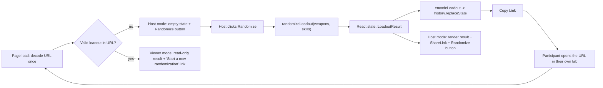

# Where Winds Meet — Speedrun Loadout Randomizer

## Product & Technical Specification

---

## 1. Overview

### 1.1 Vision

A fast, client-side single-page app that supports the guild's speedrun event: each participant fights a specific boss using a **randomized loadout** — 2 different martial arts and 8 unique mystic skills. The host randomizes a loadout, then **shares the exact result via a URL** so participants can open it and see precisely what they've been assigned. There is no backend: the URL's query string is the only persistence layer.

This is the third app in the `wwm` monorepo, alongside the [Boss Guide](SPEC.md) and the [Reforge Pity Tracker](reforge-app.md). Like the Reforge Tracker, it is a pure client-side SPA (no CMS, no server) — but unlike Reforge, it has **no persisted state at all** beyond what's encoded into the current URL.

### 1.2 Goals

| #   | Goal                                                     | Success Metric                                                |
| --- | --------------------------------------------------------- | --------------------------------------------------------------- |
| 1   | Let the host randomize a valid loadout in one click       | 1 click -> 2 different martial arts + 8 unique skills           |
| 2   | Make results trivially shareable                         | Copy-link button yields a URL that reproduces the exact result |
| 3   | Make the weapon/skill pools easy to extend over time       | Adding an entry is a one-line data change, no schema change    |

### 1.3 Target Audience

- The guild event **host**, who randomizes a loadout per participant and shares the link.
- **Participants**, who open the shared link to see their assigned weapons/skills before fighting the boss.

---

## 2. Rules Modeled

- **Weapon 1 and Weapon 2 (martial arts)**: both drawn uniformly from the full weapon pool — **guaranteed different** from each other.
- **8 mystic skills**: drawn **unique**, without replacement, from the single pool of ALL mystic skills.
- The **boss** is chosen and communicated by the host outside the app — it is not part of the randomized or shared state (see §10 Out of Scope).
- **`isDps` flag (weapons only)**: a past version of this event restricted Weapon 1 to DPS-only weapons. That restriction has been **removed** — both slots now draw from the full pool. The `isDps` flag is kept on each weapon entry (not deleted) in case a future event wants to reintroduce a DPS-only slot; it is currently unused by the randomizer. See `randomize.ts` for the one-line change that would bring it back.

---

## 3. Information Architecture

```
Speedrun Loadout Randomizer (/)
└── Single page, mode fixed at load time from the URL:
    ├── Host mode (no/invalid loadout in the URL at mount)
    │   ├── RandomizeButton ("Randomize" / "Randomize Again")
    │   ├── LoadoutResult (once a result exists)
    │   └── ShareLink (copyable absolute URL)
    └── Viewer mode (a valid loadout decoded from the URL at mount)
        ├── "Shared result" banner + "Start a new randomization" link
        └── LoadoutResult (read-only)
```

Mode is decided **once, at initial page load**, and never re-evaluated — a link is either "fresh" (host) or "a shared result" (viewer) for the lifetime of that page load. See §6.1.

---

## 4. Data Model

Two hand-maintained, flat arrays are the entire content model. Defined in [apps/speedrun/src/types/randomizer.ts](../apps/speedrun/src/types/randomizer.ts):

```typescript
interface WeaponEntry {
  id: string; // stable, unique - referenced directly in shareable URLs
  name: string;
  image: string; // path under /images/weapons/...; any format (png/jpg/webp/svg)
  isDps: boolean; // currently unused by the randomizer - reserved for a possible future DPS-only slot
}

interface SkillEntry {
  id: string;
  name: string;
  image: string; // path under /images/skills/...; any format (png/jpg/webp/svg)
}

// The only thing ever persisted (into the URL, not localStorage).
interface LoadoutResult {
  weapon1Id: string; // from the full weapons pool
  weapon2Id: string; // from the full weapons pool, guaranteed != weapon1Id
  skillIds: string[]; // 8 unique ids from the full skills pool
}
```

- [apps/speedrun/src/data/weapons.ts](../apps/speedrun/src/data/weapons.ts) — `WEAPONS: WeaponEntry[]`. Both randomized weapon slots draw uniformly from this array, unfiltered. **To add a martial art**: append one entry, then drop its image (any format) into `public/images/weapons/`.
- [apps/speedrun/src/data/skills.ts](../apps/speedrun/src/data/skills.ts) — `SKILLS: SkillEntry[]`, one flat pool (no DPS/non-DPS split for skills). **To add a mystic skill**: append one entry, then drop its image into `public/images/skills/`.
- Both files currently hold **real weapon/skill entries and art** for the event (earlier placeholder entries have been fully replaced). To add more, just append entries following the same shape and drop images under `public/images/` — no code changes needed.
- [apps/speedrun/src/data/data.test.ts](../apps/speedrun/src/data/data.test.ts) guards the pools: every entry has a non-empty `id`/`name`/`image`, ids are unique within each pool, at least 2 weapons, and at least 8 skills. It does **not** require any DPS-flagged weapon — `isDps` is optional/inert data (see §2). Keep this test green when editing the data files.
- **Never reuse or repurpose an `id`** that a live event's already-shared links might still reference.

---

## 5. Core Logic

Framework-free, unit-tested functions in [apps/speedrun/src/lib](../apps/speedrun/src/lib) (tests alongside each module).

### 5.1 Randomization (`randomize.ts`)

```typescript
function randomizeLoadout(weapons: WeaponEntry[], skills: SkillEntry[], rng: () => number = Math.random): LoadoutResult;
```

- Weapon 1: a uniform random pick from the full `weapons` pool.
- Weapon 2: a uniform random pick from `weapons` **excluding weapon 1's id** — this is what enforces "must differ".
- 8 mystic skills: drawn via a partial Fisher–Yates shuffle over `skills` (no replacement) — every permutation of every 8-sized subset is equally likely given an unbiased `rng`.
- `rng` is injectable so tests can drive the engine deterministically (see `randomize.test.ts`).
- Throws a descriptive `Error` if a pool is too small to satisfy the rules (fewer than 2 weapons total, or fewer than 8 skills) — the UI catches this and shows a friendly message instead of crashing.
- `WeaponEntry.isDps` is **not** read by this function. A past version restricted weapon 1 to `weapons.filter((w) => w.isDps)`; that restriction was removed per product decision, but the flag stays on the data model so it can be reintroduced with a one-line change if a future event wants it back.

### 5.2 Shareable URL (`shareLink.ts`)

```typescript
function encodeLoadout(loadout: LoadoutResult): URLSearchParams; // w1=<id>&w2=<id>&s=<id1>,<id2>,...,<id8>
function decodeLoadout(params: URLSearchParams, weapons: WeaponEntry[], skills: SkillEntry[]): LoadoutResult | null;
function buildShareUrl(loadout: LoadoutResult, origin: string, pathname: string): string;
```

`decodeLoadout` is strict and **never throws** — it returns `null` unless `w1`/`w2` both resolve to real, distinct weapon ids, and `s` is exactly 8 unique, resolvable skill ids. A stale, hand-edited, or garbage URL (or one referencing ids since removed from the data files) simply falls back to the empty host state. `buildShareUrl` takes `origin`/`pathname` as plain arguments rather than reading `window` directly, keeping the module pure and unit-testable; the hook supplies `window.location.origin`/`window.location.pathname`.



### 5.3 Display order

The drawn `skillIds` are re-sorted back into their original `SKILLS` pool order before rendering (not the shuffled draw order), so the grid reads consistently every time — the randomness is in *which* 8 are picked, not in how they're laid out on screen.

---

## 6. UI / UX

### 6.1 Host vs. viewer mode

Decided **once, at initial page load**, from whether the URL already had a valid, decodable loadout — never re-evaluated afterward:

- **Host mode** (bare URL, or an invalid/stale one): empty state + `RandomizeButton`. After the first randomize, shows the result + `ShareLink`, and **keeps the `RandomizeButton` visible** so the host can keep re-rolling for each next participant in the same tab. Each click overwrites the on-screen result and the address bar via `history.replaceState` (not `pushState`, so rerolling doesn't pile up back-button history); already-copied earlier links are unaffected since they're plain text elsewhere (Discord, etc.).
- **Viewer mode** (a URL that decoded successfully): **read-only** — the result plus a "Shared result" banner, no `RandomizeButton`. A "Start a new randomization" link (a real navigation to the bare path) lets a viewer who wants their own roll drop into host mode.

### 6.2 Components ([apps/speedrun/src/components](../apps/speedrun/src/components))

- **EntryCard** — a weapon or skill: a fixed 1:1 aspect-ratio image frame (so the grid never jumps around as art of varying dimensions gets swapped in) plus its name. No badges/tags — every weapon and skill is displayed identically, regardless of any metadata (e.g. `isDps`) it carries.
- **ImageWithFallback** — renders an entry's image via a plain `` (PNG, JPEG, WEBP, or SVG all work identically), falling back to a styled initials box if the image 404s or fails to decode — mirrors the Boss Guide's "Clip unavailable" pattern (see [SPEC.md](SPEC.md) §4.3). Also covers the case of a shared link referencing an id whose entry was later removed from the data files (`LoadoutResult` renders an "Unavailable" placeholder slot for that case).
- **LoadoutResult** — 2 `EntryCard`s for the weapons + an 8-up responsive grid of `EntryCard`s for the mystic skills, sorted to pool order. Both weapon slots render exactly the same way.
- **RandomizeButton**, **ShareLink** — host-mode only.

### 6.3 Theme

Reuses the wuxia dark ink-wash palette from the Reforge Tracker / Boss Guide ([apps/speedrun/src/index.css](../apps/speedrun/src/index.css), Tailwind 4 `@theme`): `bg #0f0f0f`, `surface #1a1a2e`, `fg #e8e6e3`, `gold #c9a84c`, `border #2a2a3e`. Mobile-first.

### 6.4 State

The only React state is `{ loadout, isViewerMode }`, owned by [useLoadout](../apps/speedrun/src/hooks/useLoadout.ts). `isViewerMode` is set once (lazily, from the URL at mount) and never flips. `randomize()` is a no-op guard in viewer mode (defense in depth — the UI never wires up a Randomize control there anyway).

---

## 7. Technical Architecture

### 7.1 Stack

| Layer           | Technology                           |
| --------------- | ------------------------------------- |
| Build tool      | Vite 8                                |
| UI              | React 18 + TypeScript 5               |
| Styling         | Tailwind CSS 4 (`@tailwindcss/vite`) |
| Icons           | lucide-react                          |
| Lint/format     | Biome (shared root config)            |
| Testing         | Vitest                                |
| Persistence     | None — the URL query string is the only state |
| Package manager | pnpm (workspace)                      |

No router, no backend, no CMS, no `localStorage` — a pure client-side SPA, even leaner than the Reforge Tracker.

### 7.2 Structure

```
apps/speedrun/
├── index.html
├── vite.config.ts          # base: '/', React + Tailwind plugins, '@' alias, port 2130
├── vitest.config.ts        # node env, '@' alias, src/**/*.test.ts
├── tsconfig.json
├── vercel.json              # SPA rewrite fallback
├── package.json
├── AGENTS.md
├── public/
│   └── images/
│       ├── weapons/         # one image per WeaponEntry
│       └── skills/           # one image per SkillEntry
└── src/
    ├── main.tsx
    ├── App.tsx               # orchestrates header + Randomize/result/share/banner
    ├── index.css             # Tailwind + wuxia @theme tokens
    ├── types/randomizer.ts
    ├── data/
    │   ├── weapons.ts
    │   ├── skills.ts
    │   └── data.test.ts      # pool integrity checks
    ├── lib/
    │   ├── randomize.ts      # pure randomization engine
    │   ├── randomize.test.ts
    │   ├── shareLink.ts      # pure URL encode/decode/build
    │   └── shareLink.test.ts
    ├── hooks/
    │   └── useLoadout.ts     # owns { loadout, isViewerMode }, randomize(), shareUrl
    └── components/
        ├── EntryCard.tsx
        ├── ImageWithFallback.tsx
        ├── LoadoutResult.tsx
        ├── RandomizeButton.tsx
        └── ShareLink.tsx
```

### 7.3 Persistence

There is none, beyond the URL. `useLoadout` decodes `window.location.search` once at mount; `randomize()` mirrors each new result into the address bar via `history.replaceState`. A page refresh always re-decodes to exactly what was on screen, since the URL and the React state are kept in sync on every randomize.

---

## 8. Deployment

Deploys to **Vercel**, mirroring `apps/reforge`.

| Setting          | Value                                                                                                                |
| ----------------- | ---------------------------------------------------------------------------------------------------------------------- |
| Root Directory    | `apps/speedrun`                                                                                                       |
| Framework preset  | Vite (auto-detected)                                                                                                 |
| Build command     | `vite build` (via `pnpm build`)                                                                                       |
| Output directory  | `dist`                                                                                                                |
| Install           | pnpm workspace install at repo root (keep "Include files outside the root directory" enabled)                       |
| Node version      | from root `package.json` `engines.node` = `24.x` (mirrored in `apps/speedrun/package.json`)                          |
| Package manager   | detected from the root lockfile / `packageManager` field                                                             |

Creating the actual Vercel project itself is a manual dashboard step, same as it was for reforge — not something committed to this repo. Auto-deploys on push to `main`; preview deploys on PRs, once the project is created.

---

## 9. Implementation Phases

### Phase 1 — Foundation (implemented)

- [x] Vite + React 18 + TS scaffold at `apps/speedrun` with Tailwind 4 + wuxia palette, mirroring `apps/reforge`
- [x] Domain types + pure `randomizeLoadout` (2 different weapons from the full pool, 8 unique skills, pool-size guards)
- [x] Pure `encodeLoadout`/`decodeLoadout`/`buildShareUrl` — the URL is the only persistence
- [x] Host vs. viewer mode via `useLoadout`, decided once at mount
- [x] UI: `EntryCard` (+ format-agnostic `ImageWithFallback`), `LoadoutResult`, `RandomizeButton`, `ShareLink`
- [x] Placeholder weapon/skill data + placeholder SVG art + `data.test.ts` integrity checks
- [x] Vitest unit tests for the engine, the share-link codec, and the data pools
- [x] Vercel config; root workspace scripts (`dev:speedrun`, `build:speedrun`)

### Phase 2 — Content (implemented)

- [x] Replace placeholder weapon/skill entries with real names and screenshots (20 weapons, 21 skills)
- [x] Remove the "weapon 1 must be DPS" restriction per product decision; `isDps` kept on the data model for a possible future event

### Phase 3 — Possible future content work

- [ ] Confirm final weapon/skill pool sizes with the guild before the event

### Phase 4 — Future (explicitly out of scope for now — see §10)

- [ ] QR code rendering for the share link
- [ ] Optional boss name/note field carried in the shared link
- [ ] Single-slot reroll (e.g. just the 2nd weapon, or just one skill)
- [ ] History of past randomizations within a session

---

## 10. Out of Scope

- **Boss randomization or a boss field** — the boss is chosen and communicated by the host outside the app; the shared link is strictly the 2 weapons + 8 skills.
- **QR code for the share link** — a "Copy Link" button is enough for the MVP; easy to add later since the shareable state is already just a URL.
- **History of past randomizations** — each run's URL fully describes it; re-randomizing (host mode only) just produces a new URL.
- **Single-slot reroll** — a full re-randomize is the only action.
- **Accounts, sync, or a backend.**

---

## 11. Legal / Copyright

_Where Winds Meet_ is developed by Everstone Studios. This is an **unofficial fan tool**, not affiliated with or endorsed by Everstone Studios. No game assets or data-mined files are included; placeholder art ships until real screenshots are added.
